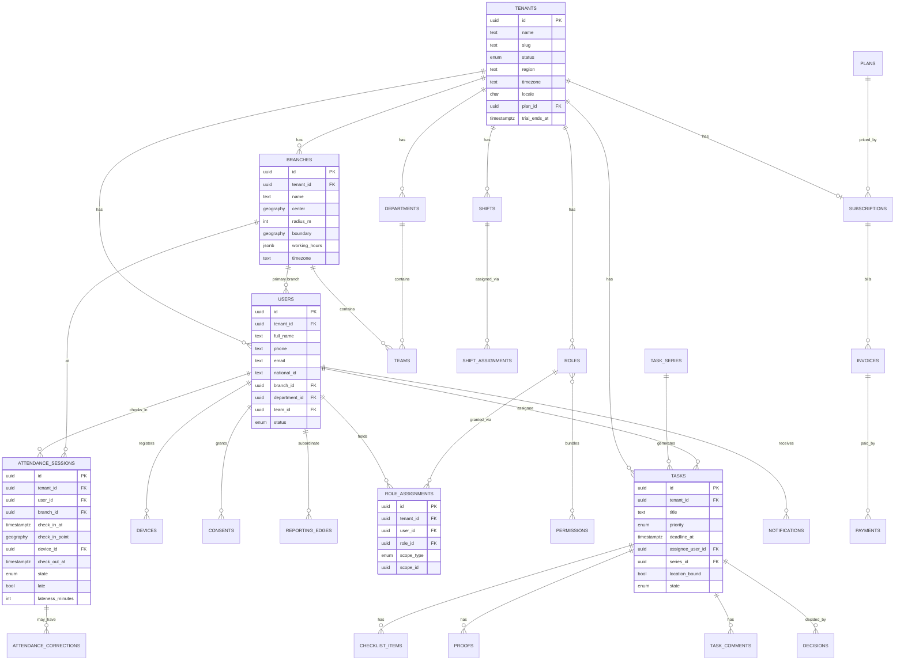
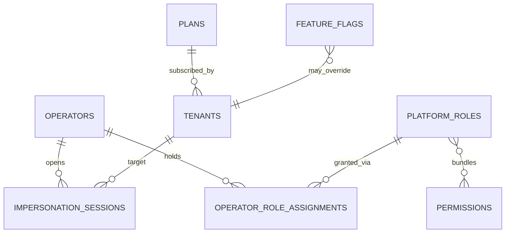

# Ara Tasks — Database Design

**Purpose:** Define the database schema — every table, its columns, and the relationships between them (Users, Companies, Tasks, Attendance, Reports, and the rest).

**Engine:** **PostgreSQL + PostGIS** (per *System Architecture*). This is a **relational** design — tables, not document collections — because the org hierarchy, scoped RBAC, and reporting are inherently relational, and geofencing needs PostGIS. Where a field is genuinely flexible (settings, recurrence rules, metadata) we use **JSONB**.

**Ownership:** tables are grouped by the module that **owns** them (from *System Architecture* §3). No module reads another module's tables directly — cross-module access goes through interfaces/events.

> **Naming note:** the customer's "**Company**" is the **`tenants`** table (a.k.a. Workspace). Its id is `tenant_id`, which appears on every tenant-scoped row.

---

## 1. Conventions & Global Rules

- **Primary keys:** `id UUID` (UUID v7 for index locality).
- **Timestamps:** `created_at`, `updated_at` → `timestamptz`, stored **UTC**, displayed **AST** (`BR-X-03`).
- **Soft delete:** `deleted_at timestamptz NULL` on user-facing entities (users, branches, tasks); hard delete elsewhere.
- **Multi-tenancy:** every tenant-scoped table has `tenant_id UUID NOT NULL` → indexed → protected by **Row-Level Security** as a backstop under the app scope engine.
- **Money:** `numeric(12,2)` + `currency char(3)` (default `SAR`).
- **Enums:** Postgres `enum` types (allowed values listed in §7), matching the states in *Business Logic*.
- **Audit:** `audit_logs` is **append-only** (no UPDATE/DELETE), enforced by DB privileges + trigger.
- **Geospatial:** `geography(Point,4326)` for locations, `geography(Polygon,4326)` for optional polygon geofences (`ATT-03`).

---

## 2. Entity-Relationship Diagram (core, tenant plane)



*(Polymorphic note: `DECISIONS` and `NOTIFICATIONS` reference a subject via `(subject_type, subject_id)` — shown linked to TASKS above, but they also cover corrections/attendance.)*

---
---

## 3. Tenant-Plane Tables (by module)

Compact format — `column type · notes`. FK = foreign key. Every tenant table also has `created_at`, `updated_at` unless noted.

### 3.1 Tenancy (foundation)

**`tenants`** — the Company / Workspace.
`id` uuid PK · `name` · `slug` unique · `status` enum(account_status) · `region` (residency) · `timezone` default `Asia/Riyadh` · `locale` default `ar` · `calendar_pref` (hijri+greg) · `weekend_days` int[] default `{5,6}` · `plan_id` FK→plans · `subscription_id` FK→subscriptions · `trial_ends_at` · `deleted_at`

### 3.2 Organization

**`branches`** — a physical location.
`id` PK · `tenant_id` FK · `name` · `code` · `center` geography(Point) · `radius_m` int · `boundary` geography(Polygon) NULL · `address` · `timezone` · `working_hours` jsonb · `status` · `deleted_at`

**`departments`** — a function (may span branches).
`id` PK · `tenant_id` FK · `name` · `code` · `status`

**`department_branches`** — optional explicit cross-branch coverage (`ORG-06`).
`department_id` FK · `branch_id` FK · PK(department_id, branch_id)

**`teams`** — a working group inside a branch/department.
`id` PK · `tenant_id` FK · `branch_id` FK NULL · `department_id` FK NULL · `name` · `status`

**`reporting_edges`** — the hierarchy + matrix + primary manager (`ORG-08/09/10`).
`id` PK · `tenant_id` FK · `subordinate_user_id` FK→users · `manager_user_id` FK→users · `is_primary` bool
Constraints: unique(subordinate, manager); **partial unique** ensuring one `is_primary=true` per subordinate.

### 3.3 Users & Identity

**`users`** — the roster.
`id` PK · `tenant_id` FK · `full_name` · `phone` · `email` NULL · `national_id` NULL · `job_title` · `branch_id` FK NULL · `department_id` FK NULL · `team_id` FK NULL · `status` enum(user_status) · `locale` · `deleted_at`
Constraint: unique(tenant_id, phone).

**`invitations`** — pending joins (`USR-02`).
`id` PK · `tenant_id` FK · `phone`/`email` · `role_id` FK · `scope_type` · `scope_id` · `token_hash` · `status` enum · `invited_by` FK→users · `expires_at`

**`devices`** — bound devices (`USR-09/10`, `BR-V-*`).
`id` PK · `tenant_id` FK · `user_id` FK · `fingerprint` · `platform` enum(ios/android) · `push_token` · `status` enum(bound/pending_rebind/revoked) · `bound_at` · `last_seen_at`
Constraint: **partial unique** one `status='bound'` per user.

**`consents`** — PDPL consent records (`LOC-07`, `BR-C-01`).
`id` PK · `tenant_id` FK · `user_id` FK · `type` enum(location/biometric) · `granted` bool · `policy_version` · `granted_at` · `revoked_at` NULL

### 3.4 Auth (foundation)

**`user_credentials`** — `user_id` FK PK · `password_hash` · `updated_at`
**`refresh_tokens`** — `id` PK · `user_id` FK · `device_id` FK · `token_hash` · `audience` enum(tenant/operator) · `expires_at` · `revoked_at` NULL
**`otp_codes`** — `id` PK · `phone`/`user_id` · `code_hash` · `purpose` · `attempts` int · `expires_at` · `consumed_at` NULL
**`two_factor`** — `user_id` FK PK · `secret` · `enabled` bool (mandatory for operators, optional tenant P2)

### 3.5 RBAC (foundation)

**`permissions`** — seeded registry (`RBAC-01`).
`id` PK · `key` unique (e.g. `task:approve`) · `resource` · `action` · `is_sensitive` bool · `plane` enum(tenant/platform)

**`roles`** — default (copied per tenant) or custom (`RBAC-02/03`).
`id` PK · `tenant_id` FK NULL (NULL = platform) · `name` · `description` · `is_default` bool · `plane` enum

**`role_permissions`** — `role_id` FK · `permission_id` FK · PK(role_id, permission_id)

**`role_assignments`** — scoped grant (`RBAC-05/06`, the crucial one).
`id` PK · `tenant_id` FK · `user_id` FK · `role_id` FK · `scope_type` enum(company/branch/department/team/self) · `scope_id` uuid NULL (NULL for company/self)

### 3.6 Shifts

**`shifts`** — `id` PK · `tenant_id` FK · `name` · `start_time` time · `end_time` time · `break_minutes` int · `grace_minutes` int · `crosses_midnight` bool
**`shift_patterns`** — `id` PK · `tenant_id` FK · `name` · `rule` jsonb (RRULE/rotation)
**`shift_assignments`** — `id` PK · `tenant_id` FK · `shift_id` FK · `assignee_type` enum(user/team/branch/department) · `assignee_id` uuid · `pattern_id` FK NULL · `effective_from` date · `effective_to` date NULL
**`overtime_rules`** — `id` PK · `tenant_id` FK · `config` jsonb (`LOC-10`)
**`holidays`** — `id` PK · `tenant_id` FK · `date` · `name` (`SHF-07`)
**`leave_requests`** *(P2)* — `id` PK · `tenant_id` FK · `user_id` FK · `type` · `start_date` · `end_date` · `status` · `decided_by` FK NULL

### 3.7 Attendance

**`attendance_sessions`** — the check-in record (`ATT-01`).
`id` PK · `tenant_id` FK · `user_id` FK · `branch_id` FK · `shift_assignment_id` FK NULL · `check_in_at` · `check_in_point` geography(Point) · `check_in_device_id` FK · `geofence_valid` bool · `mock_location` bool · `check_out_at` NULL · `check_out_point` geography NULL · `state` enum(attendance_state) · `late` bool · `lateness_minutes` int · `early_departure` bool · `captured_offline` bool · `synced_at` NULL

**`attendance_absences`** — no-show days (`ATT-06`, `BR-A-03`).
`id` PK · `tenant_id` FK · `user_id` FK · `shift_assignment_id` FK · `date` · `resolved` bool · `flagged_at`

**`attendance_corrections`** — correction requests (`ATT-08/09`).
`id` PK · `tenant_id` FK · `session_id` FK NULL · `user_id` FK · `requested_by` FK · `reason` · `requested_change` jsonb · `state` enum(correction_status) · `decided_by` FK NULL · `decided_at` NULL

### 3.8 Tasks

**`task_series`** — recurring definition (`TSK-02`).
`id` PK · `tenant_id` FK · `title` · `recurrence_rule` jsonb · `template` jsonb · `active` bool · `created_by` FK

**`tasks`** — a task / instance (`TSK-01`, states `BR-T-03`).
`id` PK · `tenant_id` FK · `series_id` FK NULL · `title` · `description` · `priority` enum(task_priority) · `deadline_at` NULL · `assignee_user_id` FK NULL · `assignee_team_id` FK NULL · `branch_id`/`department_id`/`team_id` (scope) · `location_bound` bool · `required_proof` jsonb (`BR-P-02`) · `state` enum(task_state) · `overdue` bool · `created_by` FK · `deleted_at`

**`checklist_items`** — `id` PK · `tenant_id` FK · `task_id` FK · `text` · `is_required` bool · `is_done` bool · `done_by` FK NULL · `done_at` NULL · `sort` int

**`task_comments`** — `id` PK · `tenant_id` FK · `task_id` FK · `author_id` FK · `body` · `created_at` (`TSK-10`)

**`task_tags`** — `task_id` FK · `tag` text · PK(task_id, tag)

### 3.9 Proof

**`proofs`** — evidence items (`PRF-*`).
`id` PK · `tenant_id` FK · `task_id` FK · `checklist_item_id` FK NULL · `type` enum(photo/note/video/checklist/signature) · `storage_key` NULL · `thumbnail_key` NULL · `note_text` NULL · `captured_point` geography NULL · `captured_at` · `device_id` FK NULL · `metadata` jsonb · `created_by` FK

### 3.10 Approvals & Escalation

**`decisions`** — approve/reject log (`APR-01/02`, `BR-D-*`). Polymorphic subject.
`id` PK · `tenant_id` FK · `subject_type` enum(task/correction) · `subject_id` uuid · `decision` enum(approved/rejected) · `reason` NULL (required if rejected) · `decided_by` FK · `decided_at`
Concurrency: state transition guarded (`UPDATE ... WHERE state='submitted'`) → first-decision-wins (`BR-D-04`, `BR-X-02`).

**`escalations`** — escalation progression (`BR-E-*`).
`id` PK · `tenant_id` FK · `subject_type` · `subject_id` · `level` int · `timer_deadline` · `escalated_to_user_id` FK NULL · `triggered_at` · `resolved_at` NULL

> **Approval inbox** is a **query/view** over `tasks` in `submitted` state within the manager's scope — not a table.

### 3.11 Notifications (foundation)

**`notifications`** — `id` PK · `tenant_id` FK · `recipient_user_id` FK · `type` (event key) · `title` · `body` · `priority` enum(low/normal/high/urgent) · `related_type` · `related_id` · `channels_sent` jsonb · `read_at` NULL · `created_at`
**`notification_preferences`** — `id` PK · `user_id` FK · `event_class` · `channels` jsonb · `muted` bool (`BR-N-16`)

### 3.12 Billing

**`subscriptions`** — `id` PK · `tenant_id` FK · `plan_id` FK · `status` enum(account_status) · `seats` int · `period_start` · `period_end` · `trial_ends_at` · `external_ref` (MyFatoorah) 
**`invoices`** — `id` PK · `tenant_id` FK · `subscription_id` FK · `number` · `amount` numeric · `currency` · `status` enum(paid/unpaid/failed) · `issued_at` · `due_at` · `paid_at` NULL · `zatca_uuid` NULL *(P2)* · `external_ref`
**`payments`** — `id` PK · `tenant_id` FK · `invoice_id` FK · `amount` numeric · `method` · `status` · `external_ref` · `processed_at`

### 3.13 Settings

**`settings`** — `id` PK · `tenant_id` FK · `category` · `key` · `value` jsonb · unique(tenant_id, category, key)
**`feature_toggles`** — `id` PK · `tenant_id` FK · `feature` (face_verification/ai/…) · `enabled` bool · `updated_by` FK (`SET-07`, `BR-C-04`)

### 3.14 Audit (foundation)

**`audit_logs`** — append-only (`AUD-*`, `BR-C-05`).
`id` PK · `tenant_id` FK NULL · `actor_type` enum(user/operator/system) · `actor_id` uuid · `action` · `resource_type` · `resource_id` uuid · `scope` · `before` jsonb · `after` jsonb · `ip` inet · `created_at`
Rule: no UPDATE/DELETE (DB privilege + trigger).

### 3.15 Reports

Reports have **no primary tables** — dashboards are computed from **read models / materialized views** fed by events (e.g. `mv_attendance_daily`, `mv_task_completion`, `mv_proof_coverage`). Only generated artifacts persist:
**`report_exports`** — `id` PK · `tenant_id` FK · `type` · `params` jsonb · `format` (pdf/xlsx/csv) · `status` · `storage_key` NULL · `requested_by` FK · `created_at`
**`scheduled_reports`** *(P2)* — `id` PK · `tenant_id` FK · `type` · `schedule` · `recipients` jsonb · `format`

---
---

## 4. Platform-Plane Tables (separate service/schema)

Isolated from tenant operational tables (`BR-O-01`). Own identity space.

**`operators`** — `id` PK · `full_name` · `email` unique · `status` · `two_fa_enabled` bool
**`operator_credentials`** / **`operator_sessions`** — separate from tenant auth (`BR-R-05`)
**`platform_roles`** / **`platform_role_permissions`** / **`operator_role_assignments`** — mirror of RBAC for the operator plane
**`plans`** — `id` PK · `name` · `price` numeric · `currency` · `interval` enum(monthly/annual) · `seat_based` bool · `entitlements` jsonb (`PLT-10/11`)
**`feature_flags`** — `id` PK · `scope` enum(global/tenant) · `tenant_id` NULL · `flag` · `enabled` bool (`PLT-12`)
**`impersonation_sessions`** — break-glass (`PLT-08/09`, `BR-O-02/03`).
`id` PK · `operator_id` FK · `tenant_id` FK · `reason` · `consent_ref` · `read_only` bool · `scope` jsonb · `started_at` · `expires_at` · `ended_at` NULL
→ writes to **both** `platform_audit_logs` and the tenant's `audit_logs`.
**`platform_audit_logs`** — append-only, like `audit_logs` for operator actions (`PLT-17`)



---
---

## 5. Key Relationships (cardinality summary)

| Relationship | Type | Notes |
|---|---|---|
| tenant → branches/departments/users/… | 1:N | everything is tenant-scoped |
| branch → teams; department → teams | 1:N | team sits in a branch/department |
| user ↔ manager | **M:N** | via `reporting_edges` (matrix), one `is_primary` |
| user → role (scoped) | **M:N** | via `role_assignments` + `scope_type/scope_id` |
| role ↔ permission | M:N | via `role_permissions` |
| user → devices | 1:N | one `bound` at a time |
| shift → users/teams | M:N | via `shift_assignments` |
| user → attendance_sessions | 1:N | one open session at a time (`BR-A-07`) |
| session → corrections | 1:N | request/approve |
| task_series → tasks | 1:N | recurring instances |
| task → checklist_items/proofs/comments | 1:N | |
| task/correction → decisions | 1:N (log) | first locks state |
| plan → subscriptions → invoices → payments | 1:N chain | billing |

---
---

## 6. Key Indexes

| Table | Index | Why |
|---|---|---|
| every tenant table | `(tenant_id)` and composite `(tenant_id, <hot col>)` | tenant isolation + query speed |
| `branches` | **GiST** on `center` / `boundary` | geofence point-in-polygon / radius (`ATT-03`) |
| `attendance_sessions` | `(tenant_id, user_id, check_in_at)`; `(tenant_id, branch_id, state)` | timelines + "who's in now" (`ATT-12`) |
| `tasks` | `(tenant_id, assignee_user_id, state)`; `(tenant_id, deadline_at)` | my-day + overdue scans |
| `role_assignments` | `(tenant_id, user_id)`; `(scope_type, scope_id)` | permission resolution per request |
| `reporting_edges` | `(subordinate_user_id)`; partial unique on `is_primary` | scope cascade + one primary |
| `devices` | partial unique `(user_id) WHERE status='bound'` | one bound device |
| `notifications` | `(recipient_user_id, read_at)` | unread feed |
| `audit_logs` | `(tenant_id, created_at)`; `(resource_type, resource_id)` | audit search |

---
---

## 7. Enum / Status Vocabulary (matches *Business Logic*)

| Enum | Values |
|---|---|
| `account_status` | trial · active · grace · suspended · terminated |
| `user_status` | invited · active · suspended · deactivated |
| `task_state` | open · in_progress · submitted · approved · reopened · cancelled |
| `task_priority` | low · medium · high · urgent |
| `attendance_state` | open · closed · auto_closed · pending_sync |
| `correction_status` | pending · approved · rejected |
| `decision` | approved · rejected |
| `scope_type` | company · branch · department · team · self |
| `notification_priority` | low · normal · high · urgent |
| `device_status` | bound · pending_rebind · revoked |
| `plane` | tenant · platform |

---
---

## 8. Representative DDL (the tricky ones)

The patterns worth pinning down in code:

```sql
-- Branch with PostGIS geofence (ATT-03)
CREATE TABLE branches (
  id          uuid PRIMARY KEY DEFAULT uuidv7(),
  tenant_id   uuid NOT NULL REFERENCES tenants(id),
  name        text NOT NULL,
  code        text,
  center      geography(Point,4326) NOT NULL,
  radius_m    integer NOT NULL DEFAULT 150,
  boundary    geography(Polygon,4326),          -- optional polygon
  timezone    text NOT NULL DEFAULT 'Asia/Riyadh',
  working_hours jsonb,
  status      text NOT NULL DEFAULT 'active',
  created_at  timestamptz NOT NULL DEFAULT now(),
  updated_at  timestamptz NOT NULL DEFAULT now(),
  deleted_at  timestamptz
);
CREATE INDEX branches_geo_gix ON branches USING GIST (center);

-- Geofence check at check-in (radius OR polygon)
-- ST_DWithin(center, point, radius_m)  OR  ST_Covers(boundary, point)

-- Scoped role assignment (RBAC-06) — the heart of access control
CREATE TABLE role_assignments (
  id         uuid PRIMARY KEY DEFAULT uuidv7(),
  tenant_id  uuid NOT NULL REFERENCES tenants(id),
  user_id    uuid NOT NULL REFERENCES users(id),
  role_id    uuid NOT NULL REFERENCES roles(id),
  scope_type scope_type NOT NULL,               -- company|branch|department|team|self
  scope_id   uuid,                              -- NULL for company/self
  created_at timestamptz NOT NULL DEFAULT now()
);
CREATE INDEX ra_user_ix  ON role_assignments (tenant_id, user_id);
CREATE INDEX ra_scope_ix ON role_assignments (scope_type, scope_id);

-- Reporting hierarchy + one Primary Manager (ORG-08/09/10)
CREATE TABLE reporting_edges (
  id                  uuid PRIMARY KEY DEFAULT uuidv7(),
  tenant_id           uuid NOT NULL REFERENCES tenants(id),
  subordinate_user_id uuid NOT NULL REFERENCES users(id),
  manager_user_id     uuid NOT NULL REFERENCES users(id),
  is_primary          boolean NOT NULL DEFAULT false,
  UNIQUE (subordinate_user_id, manager_user_id)
);
CREATE UNIQUE INDEX one_primary_manager
  ON reporting_edges (subordinate_user_id) WHERE is_primary;

-- One bound device per user (BR-V-01)
CREATE UNIQUE INDEX one_bound_device
  ON devices (user_id) WHERE status = 'bound';

-- Row-Level Security backstop (defense in depth)
ALTER TABLE tasks ENABLE ROW LEVEL SECURITY;
CREATE POLICY tenant_isolation ON tasks
  USING (tenant_id = current_setting('app.tenant_id')::uuid);
```

---
---

## 9. Design Decisions & Rationale

| Decision | Why |
|---|---|
| Relational (Postgres), not documents | Hierarchy + scoped RBAC + reporting are relational; joins are the point |
| PostGIS geometry for geofence | Native, indexed point-in-polygon/radius — don't hand-roll distance math |
| `tenant_id` + RLS on every table | Defense in depth; a query bug can't cross tenants |
| Scoped `role_assignments` table | Makes "permission at a scope" first-class and queryable |
| Matrix via `reporting_edges` + partial-unique primary | Models multi-manager reality with one accountable line |
| `decisions` as a log + state-guarded update | First-decision-wins without locks fighting each other |
| Proof media in object storage, keys in DB | Never store blobs in Postgres; keep rows lean |
| JSONB for settings/recurrence/metadata | Flexible config without schema churn |
| Append-only `audit_logs` | Accountability requires immutability |
| Platform tables in a separate service/schema | Physical isolation of the operator plane (`BR-O-01`) |

---

## 10. MVP vs Later

- **MVP tables:** everything in §3 except `leave_requests`, `scheduled_reports`, `zatca_uuid`; §4 platform tables (needed to run the SaaS).
- **Phase 2:** leave, ZATCA fields on invoices, biometric consent/template refs, AI read models, WhatsApp/SMS channel logs.
- **Phase 3:** partitioning of hot tables (`attendance_sessions`, `audit_logs`) by month; warehouse mirror for analytics; dedicated DB per large tenant.

---

*Next in the chain: the **API contract** (endpoints per module, request/response shapes) built on these tables, then the **prioritized backlog** (epics → stories) that implements them.*
