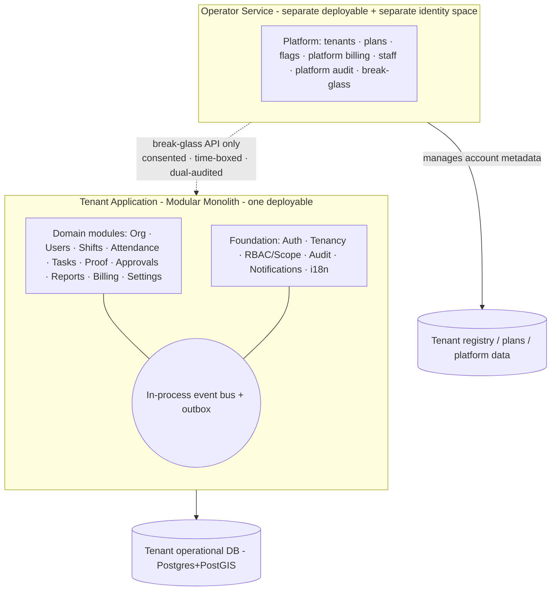
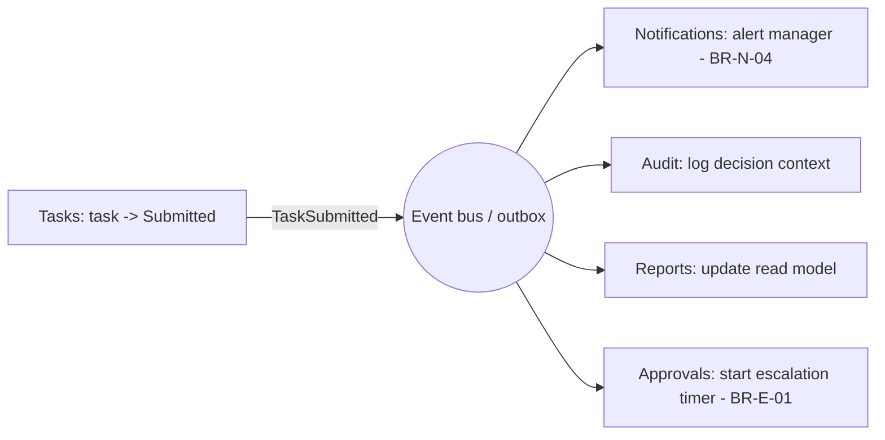

# Ara Tasks — System Architecture (Style & Module Decomposition)

**Purpose:** Decide the **architectural style** — Monolith vs Modular Monolith vs Microservices — and define the **module breakdown**: what each module owns, how modules talk, and how the system evolves. This is the deep-dive behind decision `AD-1` in *System Design*.

**Decision up front:**
> **A Modular Monolith for the tenant application, plus a physically separate Operator (Platform) service.** Not a big-ball-of-mud monolith. Not microservices. The operator service is separated because its boundary is a **security boundary** (PDPL isolation), not just code organization.

---
---

## 1. The Decision: Why Modular Monolith

### 1.1 The three options, judged against *this* product

| Criterion | Monolith (no internal boundaries) | **Modular Monolith** | Microservices |
|---|---|---|---|
| Time to MVP | Fast | **Fast** | Slow (infra, contracts, plumbing) |
| Consistency (RBAC, approvals, audit) | Easy (one transaction) | **Easy (one transaction)** | Hard (distributed transactions/sagas) |
| Team size fit (small team) | Good | **Good** | Bad (needs many owners) |
| Enforced boundaries | **No** → rots into mud | **Yes** (module contracts) | Yes (network) |
| Independent scaling | No | Not yet (extract later) | Yes |
| Operational overhead | Low | **Low** | High (observability, deploys, networking) |
| Refactor/extract later | Painful | **Cheap (seams pre-drawn)** | N/A (already split) |

### 1.2 Why not a plain monolith
A monolith *without_ internal boundaries collapses into a tangle: any code touches any table, business rules leak into controllers, and the RBAC/scope engine gets bypassed. We keep the monolith's simplicity but **impose hard module boundaries** so it never rots.

### 1.3 Why not microservices (now)
- **Distributed transactions kill our core invariants.** "First-decision-wins locking" (`BR-D-04`), "submission gate" (`BR-T-02`), and "consent-before-location" (`BR-C-01`) are far simpler and safer inside **one transaction boundary**. Sagas here would be self-inflicted pain.
- **Ops overhead** (service mesh, per-service DBs, tracing, deploy pipelines) is a tax a lean KSA-launch team shouldn't pay for value it won't get yet.
- **We don't have the scaling problem yet.** Microservices solve independent scaling and team autonomy — neither is a constraint at launch.

### 1.4 When we WOULD reconsider (explicit triggers)
Extract a module into its own service **only** when one of these is true:
- It needs **independent scaling** (different resource profile or spiky load).
- A dedicated **team owns** it and needs its own deploy cadence.
- It has a **radically different runtime** (e.g. AI/GPU).
- A **regulatory** need to physically isolate it.

Until a trigger fires, we stay modular-monolith. The seams below make each extraction cheap.

---
---

## 2. The Two-Plane Split (a security boundary, not a style choice)



**Rule (`BR-O-01`):** the Operator service has **no direct database access** to tenant operational tables (attendance, tasks, proof, PII). The *only* path in is the **break-glass API** — consented, time-boxed, read-only by default, dual-audited (`BR-O-02/03`). Making it a separate deployable turns that guarantee into a physical fact, not a policy hope.

**The Operator service is not "a microservice."** It's a second bounded context with its own identity space (`PLT-02`, `BR-R-05`). Splitting it is about isolation, not scaling.

---
---

## 3. Module Decomposition (Tenant Application)

Two layers: **Foundation** (cross-cutting capabilities every domain module uses) and **Domain** (the business modules). Each module **owns its own data** and exposes a **public interface**; internals are private.

### 3.1 Foundation modules (the shared kernel)

| Module | Responsibility | Owns | Notes |
|---|---|---|---|
| **Auth & Identity** | Login, OTP, tokens, sessions, device binding | Credentials, refresh tokens, device records | `USR-06/07/09`; two token audiences (tenant/operator) |
| **Tenancy & Residency** | Resolve tenant context, enforce isolation | Tenant registry pointer, region binding | `tenant_id` + Postgres RLS backstop; `BR-C-03` |
| **RBAC & Scope Engine** | Permission registry, role resolution, scope cascade, request guards | Roles, permissions, assignments | The heart of access control; `ORG-11`, `RBAC-06`, `BR-R-*` |
| **Audit** | Append-only immutable logging | Audit log | Consumes domain events; never mutated; `BR-C-05` |
| **Notifications** | Resolve recipients, fan out across channels, quiet-hours rules | Notification records, device tokens, prefs | Event-driven; `BR-N-*` |
| **Localization & Time** | Arabic/RTL, Hijri, AST, calendars, prayer/Ramadan windows | i18n bundles, calendar config | `LOC-*`, `BR-X-03` |

### 3.2 Domain modules

| Module | Responsibility | Owns (tables) | Key dependencies |
|---|---|---|---|
| **Organization** | Branches, departments, teams, hierarchy, primary manager | Branch(geofence,hours), Department, Team, ReportingEdge | Tenancy, RBAC |
| **Users** | Profiles, org assignment, invites, status | User profile, invitation, device-binding link | Auth, Org, RBAC |
| **Shifts** | Shifts, patterns, grace, overtime, leave (P2) | Shift, ShiftPattern, Assignment, Leave | Org, Localization |
| **Attendance** | Check-in/out, geofence validation, lateness/absence, corrections, offline sync | AttendanceSession, Correction | Shifts, Org(geofence), Users(device) |
| **Tasks** | Tasks, recurring series/instances, checklists, lifecycle | Task, TaskInstance, Checklist | Org, Users, Proof(query) |
| **Proof** | Proof items, media metadata, storage keys, gallery | Proof, MediaObject(ref) | Object storage; Tasks(query) |
| **Approvals & Escalation** | Decisions, approval inbox, first-decision lock, escalation engine | Decision, EscalationState | Tasks, Attendance, RBAC, Notifications(events) |
| **Reports & Analytics** | Dashboards, KPIs, exports | Read models / materialized views | Reads via events/read-model, **not** by joining others' tables |
| **Billing & Subscriptions** | Subscription, invoices, MyFatoorah, account lifecycle | Subscription, Invoice, Payment | External MyFatoorah; emits account-state events |
| **Settings** | Company/attendance/task/localization/privacy settings, feature toggles | Setting, FeatureToggle | Consumed by all; `SET-*` |

### 3.3 Concrete folder shape (NestJS)

```
/src
  /foundation
    /auth        /tenancy     /rbac
    /audit       /notifications  /localization
  /modules
    /organization  /users     /shifts      /attendance
    /tasks         /proof     /approvals   /reports
    /billing       /settings
  /shared
    /events (contracts)  /outbox  /common
/operator-service        <-- SEPARATE deployable
  /platform (tenants, plans, flags, billing, staff, audit, break-glass)
```

**Per-module internal layering** (keeps rules out of controllers):
`api/` (controllers, DTOs) → `application/` (use-cases/services) → `domain/` (entities + business rules from *Business Logic*) → `infrastructure/` (repositories, external adapters).

---
---

## 4. How Modules Communicate

Two mechanisms, chosen deliberately:

### 4.1 Synchronous — public service interfaces (request/response)
When a module needs an answer *now*: it calls another module's **published interface**, never its repository or tables.
- Example: `Tasks` asks `Proof.hasRequiredProof(taskId)` at the submission gate (`BR-T-02`).
- Example: every request passes the `RBAC` guard to check `resource:action` in scope.

**Rule:** a module imports another module's **interface/contract**, not its internals. No cross-module table reads. Ever.

### 4.2 Asynchronous — domain events (in-process bus + transactional outbox)
When something *happened* and others should react without the source caring who: publish a **domain event**. Reliability via a **transactional outbox** (event written in the same DB transaction as the state change, then dispatched).



**Core events:** `CheckedIn`, `LateDetected`, `AbsenceDetected`, `TaskAssigned`, `TaskSubmitted`, `TaskApproved`, `TaskReopened`, `CorrectionRequested`, `CorrectionDecided`, `EscalationTriggered`, `PaymentFailed`, `AccountStateChanged`, `ImpersonationStarted`.

**Why events matter here:** `Tasks` doesn't know about `Notifications`, `Audit`, or `Reports`. That decoupling is exactly what makes a future extraction cheap — the event contract already exists; only the transport changes (in-process bus → message broker).

### 4.3 Reports never joins into other modules' tables
`Reports` builds **read models** fed by events (or materialized views on a read replica for MVP). This keeps it from becoming a spider that couples every module — and makes it the natural **second extraction** (after AI) when reporting load grows.

---
---

## 5. Dependency Rules (what keeps it "modular")

1. **Domain → Foundation only.** Domain modules may depend on foundation (Auth, Tenancy, RBAC, Localization). They must **not** depend on each other's internals.
2. **Cross-domain interaction = interface call or event.** Nothing else.
3. **Each module owns its tables.** No foreign module reads or writes them directly.
4. **No circular dependencies.** If two modules need each other synchronously, that's a smell — invert it with an event.
5. **Business rules live in `domain/`,** never in controllers (`api/`). Controllers orchestrate; they don't decide.
6. **The two planes never share a process or credentials** (`BR-R-05`).

Enforce these with lint/architecture tests (e.g. dependency-cruiser / module-boundary checks in CI) so a violation **fails the build**, not a code review.

---
---

## 6. Evolution Path (pre-drawn extraction seams)

Because modules already own their data and talk via contracts/events, extracting one to its own service later is mechanical, not a rewrite. Recommended order **if/when** a trigger (§1.4) fires:

| Order | Extract | Trigger |
|---|---|---|
| 1 | **AI Layer** (Phase 2, born separate) | Different runtime (Python/GPU), independent | 
| 2 | **Reports & Analytics** | Heavy read load / warehouse needs |
| 3 | **Notifications** | Fan-out spikes, channel isolation |
| 4 | **Attendance ingestion** | Check-in volume at scale (many tenants, peak mornings) |
| 5 | **Proof/media processing** | Video + heavy transcoding (Phase 2/3) |

Everything else stays in the monolith. **Don't extract on a hunch — extract on a trigger.**

---
---

## 7. Anti-Patterns We Explicitly Reject

- **Shared database across modules** (module A joining module B's tables) → the #1 cause of a "distributed monolith." Banned by rule §5.3.
- **A "God" service** that everything depends on → keep foundation modules small and stable.
- **Business logic in controllers** → rules live in `domain/`.
- **Premature microservices** → distributed transactions, network failures, and ops load for zero MVP benefit.
- **Operator plane reading tenant data directly** → violates PDPL isolation; only break-glass API (§2).
- **Baking permissions into JWTs** → resolve per request so revocation is instant (from *System Design* AD-9).

---
---

## 8. Summary

| Question | Answer |
|---|---|
| Monolith, Modular Monolith, or Microservices? | **Modular Monolith** (tenant app) **+ a separate Operator service** |
| Why not microservices? | Distributed transactions break our core invariants; ops overhead ≫ MVP benefit; no scaling trigger yet |
| How many deployables at MVP? | **Two**: tenant app + operator service |
| How do modules talk? | Sync via **published interfaces**; async via **domain events + outbox** |
| Who owns data? | **Each module owns its tables**; no cross-module table access |
| How is it kept modular? | Dependency rules enforced in **CI** (build fails on violation) |
| How does it scale later? | **Extract along pre-drawn seams** — AI → Reports → Notifications → Attendance — only when a trigger fires |

> **Deployment note (dev + staging, `S0-04`):** the two deployables run as **separate Coolify services on separate domains** on the existing VPS via Docker Compose — the physical two-plane separation (§2) holds off the managed cloud, and the operator plane still has no direct tenant-DB access. This is an infra baseline only: the modular-monolith style, module boundaries, and dependency rules above are **unchanged**. Managed cloud + Terraform remain the deferred production path (see *System Design* §9, *Tech Stack* §11, `docs/state/DECISIONS.md`).

---

*Next in the chain: the **Data Model / ERD** (entities, ownership per module, tenant keys, indexes), then the **API contract** (endpoints per module), then the **prioritized backlog**.*
