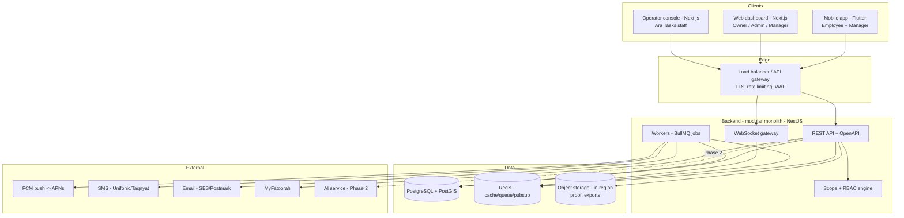
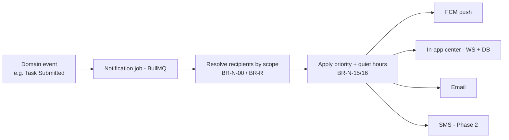
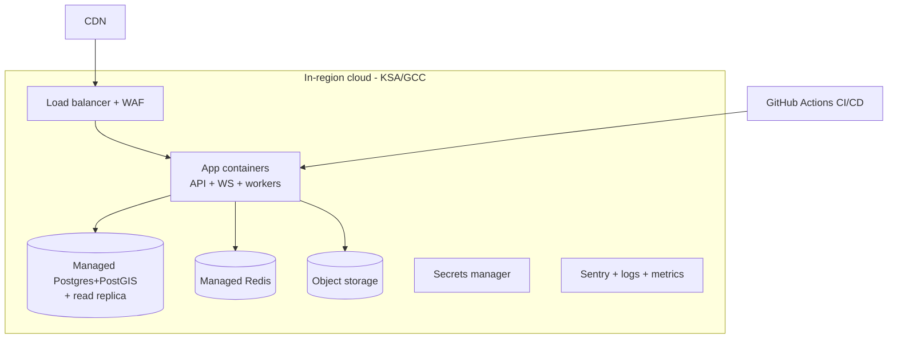
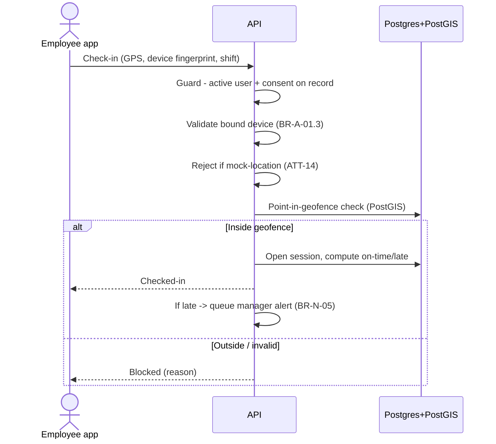
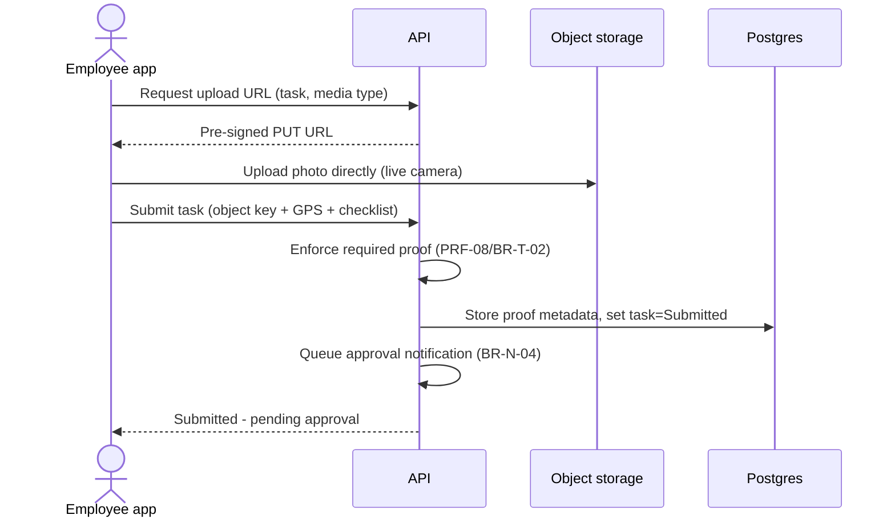

# Ara Tasks — System Design & Architecture

**Purpose:** Design the whole system end to end — clients, backend, database, storage, auth, notifications, and infrastructure — for a **multi-tenant SaaS** delivered as **native apps (Apple App Store + Google Play)** *and* a **web application**, launched **KSA-first**.

**Relationship to other docs:** This turns the product definition (*Project Description → Features → Roles → Flows → Business Logic*) into a buildable technical architecture. Every choice below is driven by a real constraint from those docs, not preference.

**How to read:** each section leads with the **decision**, then the **why**, then the **alternative** and any **risk**. Feature/rule IDs (`ATT-04`, `BR-A-01`) tie choices back to requirements.

---

## 0. Constraints the architecture must satisfy

Pulled straight from the product docs — these shape every decision:

1. **Multi-tenant SaaS, two planes** — isolated tenant data + a separate operator plane. `APP-07`, `BR-O-01`
2. **KSA compliance** — PDPL consent + **in-region data residency**, retention/deletion, AST time, Hijri, SAR, ZATCA (Phase 2). `LOC-*`, `BR-C-*`
3. **Field-grade attendance** — GPS + **geofence** + **device binding** + mock-location defense + **offline capture & sync**. `ATT-02/03/04/13/14`, `BR-A-*`
4. **Proof media at scale** — photos (later video), live-camera, GPS/timestamp-stamped. `PRF-*`
5. **Real-time** — "who's in now", live approval inbox, push. `ATT-12`, `NOT-01`
6. **Scoped RBAC** — `resource:action` evaluated at company/branch/department/team/self, **server-side**. `RBAC-06/07`, `BR-R-*`
7. **Background automation** — escalation timers, overdue/absence detection, recurring tasks, dunning. `APR-05`, `BR-E-*`, `BR-B-*`
8. **Three surfaces, one brain** — employee app, manager app, web dashboard, operator console — all on **one backend/API**.

---
---

## 1. High-Level Architecture

**Shape:** one **modular monolith** backend (API + WebSocket + background workers in one deployable, cleanly separated by module) behind a load balancer, talking to Postgres/PostGIS, Redis, and in-region object storage, with external providers for push/SMS/email/payments.

**Why a monolith, not microservices:** at MVP a modular monolith ships faster, is far easier to keep consistent (one RBAC engine, one transaction boundary, one deploy), and can be split later along the module seams if a piece needs independent scaling. Microservices now = premature complexity. **Decision: modular monolith; extract services only when a real scaling/ownership need appears** (the AI layer is the first natural extraction in Phase 2).

---
---

## 2. Delivery Surfaces (iOS + Android + Web)

The system is **one API with multiple clients**. Split by where the work physically happens:

| Surface | Who | Primary job | Build with |
|---|---|---|---|
| **Mobile app** | Employee + Manager | Check-in (GPS/camera/geofence), tasks, proof, approvals — **offline-capable** | **Flutter** (iOS + Android) |
| **Web dashboard** | Owner / Admin / Manager | Setup, org, reports, dashboards, approvals | **Next.js** (React + TS) |
| **Operator console** | Ara Tasks staff | Tenants, plans, billing, break-glass | **Next.js** (separate app, separate auth) |

### 2.1 Mobile — Flutter (decision)
**One Flutter app for both Employee and Manager**, rendering the right experience by permission — not two separate apps. One store listing per platform, one codebase, shared offline/sensor logic. Split later only if UX demands.

**Why Flutter:** single codebase for iOS + Android; **first-class RTL/Arabic**; excellent **offline** story (local DB + outbox); mature native plugins for **camera, GPS, background location, geofencing, secure storage, device info** (all core here); good performance for a simple, tap-light frontline UI (the #1 adoption risk, `APP-01`).
**Alternative:** React Native (shares more with the web team's React skills). **Risk with RN:** device/offline/geofence integration is fiddlier; for a field app that lives on sensors, Flutter is the safer bet.

Mobile essentials: local DB (**Drift/SQLite** or Isar) + an **outbox queue** for offline (`ATT-13`, `BR-A-08`); secure token storage (Keychain/Keystore); **device fingerprint** for binding (`USR-09`); live-camera capture only (`PRF-09`); mock-location detection (`ATT-14`).

### 2.2 Web — Next.js (decision)
React + TypeScript, RTL-first, SSR for fast dashboards. **Shares TypeScript types** with the NestJS backend (one contract, fewer bugs). Handles data-dense reporting/drill-down that a mobile screen can't. Managers can also approve from web as a bonus.

### 2.3 Operator console — separate Next.js app
Physically and logically separate from the tenant web app: **different domain, different auth audience, mandatory 2FA/SSO** (`PLT-02`, `BR-R-05`). Never shares a session or codebase-level trust with tenant surfaces.

---
---

## 3. Backend Architecture

**Decision: NestJS (Node + TypeScript), modular monolith, REST + WebSocket.**

**Why NestJS:** module system maps 1:1 to our 17 feature modules; built-in **guards/interceptors** are ideal for `resource:action` + scope enforcement on every request (`RBAC-07`); native WebSocket gateway; first-class BullMQ integration for jobs; **end-to-end TypeScript** with the web client.
**Alternatives:** Django (Python) — great admin + easiest path to the Phase-2 Arabic-NLP/AI work, but a second language from the web; Go — max performance, more boilerplate for RBAC/CRUD; Laravel — fast CRUD, weaker for realtime/jobs at scale. **Recommendation:** NestJS for the core; **Python microservice for the AI layer in Phase 2** (best-of-both).

### 3.1 Module map (monolith, clean seams)
Each maps to the feature catalog module:

`Org` · `Users/Identity` · `RBAC (scope engine)` · `Shifts` · `Attendance` · `Tasks` · `Proof` · `Approvals/Escalation` · `Reports` · `Notifications` · `Billing` · `Audit` · `Localization` · `Settings` · `Platform/Operator` · `(Phase 2) AI`.

### 3.2 The RBAC + Scope engine (core, `ORG-11`/`RBAC-06`)
- Every request passes an **auth guard** (valid token → user + tenant) then a **permission guard** (does the user hold `resource:action` **within the item's scope**?).
- Permissions are **resolved server-side per request** (cached in Redis, invalidated on role change) so edits/revocations take effect immediately — tokens carry identity, **not** a frozen permission set.
- **Deny by default** (`BR-R-01`); union of roles (`BR-R-02`); scope cascade company⊃branch⊃department⊃team⊃self (`BR-R-03`).

### 3.3 API style
**REST (OpenAPI-documented) + a WebSocket channel** for realtime. REST is cacheable, offline-sync-friendly, and simple for mobile. GraphQL is deferred — nice for dashboards but adds complexity we don't need at MVP. All write endpoints are **idempotent where they back offline sync** (idempotency keys) to survive retries.

### 3.4 Real-time (`ATT-12`, `NOT-01`)
WebSocket gateway (Socket.IO) with a **Redis adapter** for horizontal scale. Channels scoped per tenant + user/role. Powers: live "who's in now", approval-inbox updates, in-app notification delivery, live KPI tiles.

---
---

## 4. Database

**Decision: PostgreSQL + PostGIS.**

**Why Postgres:** the org hierarchy, RBAC, scoped queries, and reporting are inherently relational; JSONB covers flexible fields; it's rock-solid and hostable in-region.
**Why PostGIS (specifically):** **geofence validation is a geospatial problem** — point-in-polygon and radius/distance checks at check-in (`ATT-03`, `BR-A-01`). PostGIS does this natively and fast; rolling our own is a mistake.

### 4.1 Multi-tenancy strategy (decision)
**Shared database, shared schema, `tenant_id` on every row + PostgreSQL Row-Level Security (RLS)** as a hard backstop, on top of the app-layer scope engine.
- **Why:** best fit for many small/medium tenants; one migration path; cheap. RLS means even a query bug can't cross tenants.
- **Residency:** handled at the **regional cluster** level — a tenant is pinned to an in-region deployment (`PLT-07`, `BR-C-03`).
- **Escalation path:** a large enterprise tenant can later be moved to a **dedicated database/cluster** without changing the app model.
- **Alternative:** schema-per-tenant or DB-per-tenant — stronger isolation but heavier ops; overkill at MVP.

### 4.2 Data highlights (full ERD is the next doc)
Core entities: `Tenant`, `Branch (geofence, hours)`, `Department`, `Team`, `User`, `Role`, `Permission`, `RoleAssignment(scope)`, `Shift`, `AttendanceSession`, `Task`, `TaskInstance`, `Checklist`, `Proof`, `Decision/Approval`, `Correction`, `Notification`, `Subscription/Invoice`, `AuditLog`. Platform plane: `Operator`, `PlatformRole`, `ImpersonationSession`.

### 4.3 Cache / queue / pub-sub — Redis
One Redis for: permission cache, rate-limiting, WebSocket fan-out (pub/sub), and the **BullMQ** job broker.

### 4.4 Reporting/analytics
MVP: aggregate in Postgres (materialized views / a **read replica** for heavy reports). Later: a warehouse (ClickHouse/BigQuery) if reporting load grows. Don't build it now.

---
---

## 5. Storage (Proof media, exports, documents)

**Decision: S3-compatible object storage, in-region, accessed via pre-signed URLs.**

- **Proof photos/videos, report exports, employee documents** live in object storage — **never in the database** (DB stores metadata + object key only). `PRF-*`
- **Upload:** device gets a **pre-signed PUT URL** and uploads **directly** to storage (never proxied through the API) — critical for large media and weak connectivity.
- **Download:** short-lived **pre-signed GET URLs**; the proof gallery never exposes public links (`PRF-06`).
- **Metadata:** GPS + timestamp + device stamped server-side and stored in Postgres (`PRF-04/05`, `BR-P-01`).
- **Thumbnails:** generated async (worker job) for fast gallery loads.
- **Encryption:** SSE at rest + TLS in transit.
- **Retention:** storage **lifecycle rules** + a purge job enforce PDPL retention windows (`LOC-08`, `PRF-12`, `BR-C-02`).
- **Region:** bucket in the tenant's assigned region (`BR-C-03`).

---
---

## 6. Auth & Identity

**Decision: self-built JWT (short-lived) + rotating refresh tokens; phone-first; TOTP 2FA for privileged accounts; two fully separate identity spaces.**

### 6.1 Why self-built (not Firebase/Cognito)
Phone-OTP + **custom device binding** + **scoped RBAC** + **two planes** + **KSA data residency** together make a hosted identity provider awkward (residency + custom claims + device model). Self-built on our own backend gives full control and keeps auth data in-region. **Alternative noted:** managed auth is faster to start but fights us on residency and device binding.

### 6.2 Mechanics
- **Login:** phone/email + password, or **OTP-SMS** (KSA phone-first, `USR-06/07`).
- **Tokens:** short-lived **access JWT** (carries `user_id`, `tenant_id`, token audience = tenant|operator) + **rotating refresh token** stored server-side and **revocable**. Permissions are **resolved per request**, not baked into the token (so RBAC edits apply instantly).
- **Device binding (`USR-09`, `BR-V-01`):** the refresh token is bound to a **registered device fingerprint**; check-in validates the bound device (`ATT-04`). Re-bind needs approval (`USR-10`, `BR-V-02`).
- **2FA:** **mandatory TOTP/SSO for operators** (`PLT-02`) and recommended for Owner/Admin (`USR-13`, Phase 2).
- **Two identity spaces:** tenant users and platform operators use **separate tables, separate token audiences, separate login** — a token from one plane is meaningless in the other (`BR-R-05`).
- **Consent gate:** no location is stored until **PDPL consent** is recorded (`LOC-07`, `BR-C-01`) — enforced at login/onboarding before any check-in.

**SMS/OTP provider:** a KSA-capable provider (Unifonic / Taqnyat) for deliverability; Twilio as fallback.

---
---

## 7. Notifications Architecture

**Decision: event → job queue → scope-resolved fan-out across channels, with priority/quiet-hours rules.**

- **Push:** **FCM for both platforms** (FCM routes to APNs for iOS) — one integration. Devices register tokens; tokens cleaned up on logout/uninstall.
- **In-app center:** notifications persisted in Postgres and pushed live over WebSocket (`NOT-02`).
- **Email:** SES/Postmark for billing, escalations, scheduled reports.
- **SMS / WhatsApp:** Phase 2 channels for critical alerts and displacing the WhatsApp fallback (`NOT-09/10`).
- **Rules engine:** recipients resolved by scope; **quiet-hours/prayer suppression holds only Low/Normal; High/Urgent always deliver** (`BR-N-15`); users can mute non-critical classes but not escalation/billing (`BR-N-16`).

---
---

## 8. Background Jobs & Scheduling

**Decision: BullMQ (on Redis) for queued + scheduled work.** These are the automations behind the business rules:

| Job | Trigger | Rule |
|---|---|---|
| Escalation timers | task submitted/overdue, no decision | `BR-E-*` |
| Overdue / late / absence scan | cron (~1 min) vs shifts + check-ins | `BR-T-05`, `BR-A-02/03` |
| Missed-checkout auto-close | cron after `shift_end + cutoff` | `BR-A-05` |
| Recurring task generation | nightly, per series | `BR-T-08` |
| Notification fan-out | domain events | `BR-N-*` |
| Billing dunning / retries | payment failure, schedule | `BR-B-02` |
| Thumbnail generation | proof uploaded | `PRF-06` |
| Report generation / export | on demand / scheduled | `RPT-10/13` |
| Retention purge | nightly | `BR-C-02` |
| Offline-sync validation | on sync | `BR-A-08`, `BR-X-01` |

---
---

## 9. Infrastructure, Hosting & Delivery

**Current environment — dev + staging (owner-approved, `S0-04`):** the **existing Hostinger VPS** (Ubuntu 24.04) running **Coolify + Docker Compose**. **PostgreSQL 18 + PostGIS, Redis, and MinIO (S3-compatible) are self-hosted** as containers and kept **private** (internal Docker network only); only the tenant api/web and the operator console are exposed through Coolify's reverse proxy, each on its own domain — preserving the two-plane boundary. ARA Tasks is **isolated** on the shared VPS and does not touch other projects; secrets come from **Coolify's encrypted environment**. The managed-cloud design below is **deferred** until production scale / PDPL-cert / reliability needs justify it. See [`deploy/vps/`](../../deploy/vps/) and `docs/state/DECISIONS.md`.

**Production target (deferred managed-cloud evolution path):**

- **Hosting (residency-driven):** a major cloud with a **KSA/GCC region** — **Google Cloud (Dammam, KSA)** or **AWS (Bahrain / UAE)**; local providers (STC Cloud, Oracle Jeddah) are options if a client demands in-Kingdom certification. **PDPL residency drives this choice**, not cost (`LOC-09`, `BR-C-03`).
- **Compute:** Docker containers on a **managed container service** (Cloud Run / ECS / GKE-lite) — keep it simple at MVP; full Kubernetes only when scale needs it.
- **Managed data services:** managed Postgres (with PostGIS), managed Redis, managed object storage — less ops burden, in-region.
- **Environments:** dev → staging → prod, isolated data.
- **CI/CD:** GitHub Actions (build → test → deploy); automated DB **migrations** gated in the pipeline.
- **IaC:** Terraform. *Note: infra access (DB, servers, backups) is governed by cloud IAM — **separate from and tighter than** the app-level RBAC in this system* (`Roles doc §Infra ≠ app RBAC`).
- **Observability:** Sentry (errors), structured logs, metrics/dashboards (Grafana or managed), uptime alerts.
- **Secrets:** a **secrets manager / Vault** — never in code, never in committed env files. All provider keys (FCM, SMS, MyFatoorah) live there.

*Topology above is the **deferred production target** (managed, in-region). **Dev + staging today** run the same logical stack — Postgres+PostGIS, Redis, object storage (MinIO), app containers — **self-hosted on the existing VPS via Coolify + Docker Compose** (`S0-04`), with the data services private and only the apps proxied.*

---
---

## 10. Security & Compliance (cross-cutting)

- **Transport & rest:** TLS everywhere; encryption at rest (DB + object storage).
- **Tenant isolation:** `tenant_id` + Postgres **RLS** + app scope engine — defense in depth (`APP-07`).
- **AuthZ:** server-side `resource:action` + scope on **every** request; UI hints are never the boundary (`BR-R-04`).
- **Attendance integrity:** geofence + device binding + mock-location stacked; any hard-signal failure blocks (`BR-V-04`).
- **PDPL:** consent-before-location gate, retention/purge jobs, data residency, **data-subject request** workflows (Phase 2), templates-not-images for biometrics (Phase 2). `BR-C-*`
- **Audit:** append-only, immutable audit log with actor name on every sensitive action; hash-chaining/tamper-evidence in Phase 3 (`BR-C-05`, `AUD-08`).
- **Operator break-glass:** consented, time-boxed, read-only-by-default, **dual-audited** with an in-tenant banner (`BR-O-02/03`).
- **Hardening:** rate limiting, input validation, signed URLs for media, least-privilege service accounts, dependency scanning.

---
---

## 11. Key Data Flows

### 11.1 Check-in (the hottest path)

### 11.2 Proof upload + submit

*(Offline variant: both flows capture locally to the outbox and replay these calls on reconnect; the server re-validates geofence/device retroactively and flags conflicts — `BR-A-08`, `BR-X-01`.)*

---
---

## 12. Tech Stack Summary

| Layer | Decision | Alternative |
|---|---|---|
| Mobile (employee + manager, 1 app) | **Flutter** (iOS + Android) | React Native |
| Web dashboard | **Next.js** (React + TS) | Angular / Nuxt |
| Operator console | **Next.js** (separate app + auth) | — |
| Backend | **NestJS** (Node + TS), modular monolith | Django, Go, Laravel |
| API | **REST + OpenAPI + WebSocket** | GraphQL |
| Database | **PostgreSQL + PostGIS** | — |
| Cache / queue / pub-sub | **Redis + BullMQ** | — |
| Object storage | **S3-compatible, in-region** | GCS, Azure Blob |
| Push | **FCM (→ APNs)** | OneSignal |
| SMS / OTP | **Unifonic / Taqnyat (KSA)** | Twilio |
| Email | **SES / Postmark** | Sendgrid |
| Payments | **MyFatoorah** (per spec) | — |
| Auth | **Self-built JWT + refresh + TOTP** | Cognito / Firebase |
| Hosting | **KSA/GCC region** (GCP Dammam / AWS Bahrain-UAE) | Local KSA cloud |
| Deploy | **Docker + managed containers**, GitHub Actions, Terraform | k8s (later) |
| Observability | **Sentry + logs + metrics** | Datadog |
| AI (Phase 2) | **Python microservice** (Arabic NLP) | — |

---
---

## 13. Key Decisions & Risks (ADR-style)

| # | Decision | Rationale | Risk / mitigation |
|---|---|---|---|
| AD-1 | Modular monolith, not microservices | Ship fast, one RBAC + transaction boundary | Split along module seams when scaling demands; AI is first extraction |
| AD-2 | Flutter mobile + Next.js web | Best field-app + best dashboard, each optimized | Two codebases; mitigate with shared API contract + design system |
| AD-3 | One mobile app for employee + manager | Fewer store listings, shared code | Role-based UI must stay simple for frontline; split later if needed |
| AD-4 | Shared DB + tenant_id + RLS | Cheap, one migration path, safe backstop | Move big tenants to dedicated DB later; RLS covers query bugs |
| AD-5 | PostGIS for geofence | Native, fast geospatial | None material |
| AD-6 | Self-built phone-first auth | Residency + device binding + 2 planes | More to build/secure; use battle-tested libs, never roll crypto |
| AD-7 | Direct-to-storage signed URLs | Handles large media + weak signal | Enforce content/type + size server-side; validate metadata |
| AD-8 | In-region hosting (KSA/GCC) | PDPL residency is non-negotiable | Region must carry the compliance certs the client needs |
| AD-9 | Permissions resolved per request (not in token) | Instant revocation/edits | Cache in Redis to keep it fast |

---

## 14. What's MVP vs Later (architecture view)

- **MVP:** monolith, Postgres+PostGIS, Redis+BullMQ, object storage, FCM push, self-built auth, Flutter app + Next.js web + operator console, in-region single-region deploy.
- **Phase 2:** Python **AI microservice**, SMS/WhatsApp channels, face-verification pipeline (templates), ZATCA e-invoicing service, read replica/warehouse for heavy reporting.
- **Phase 3:** multi-region, dedicated DBs for large tenants, warehouse-backed analytics, reseller/white-label portals.

---

*Next in the chain: the concrete **Data Model / ERD** (entities, relationships, tenant keys, indexes), then the **API contract** (OpenAPI endpoints per module), then a **prioritized backlog** mapping stories to this architecture.*
