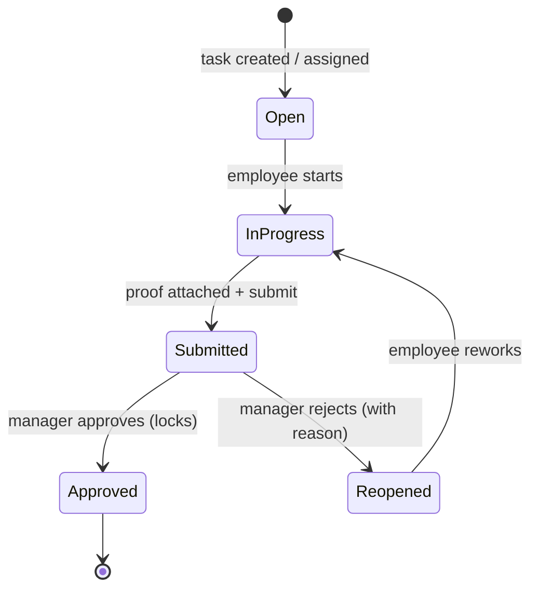
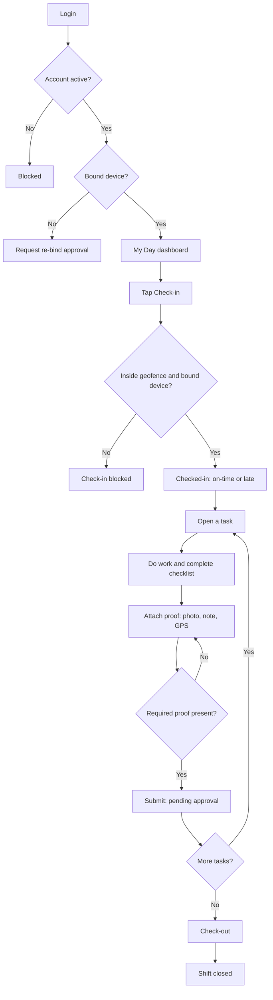
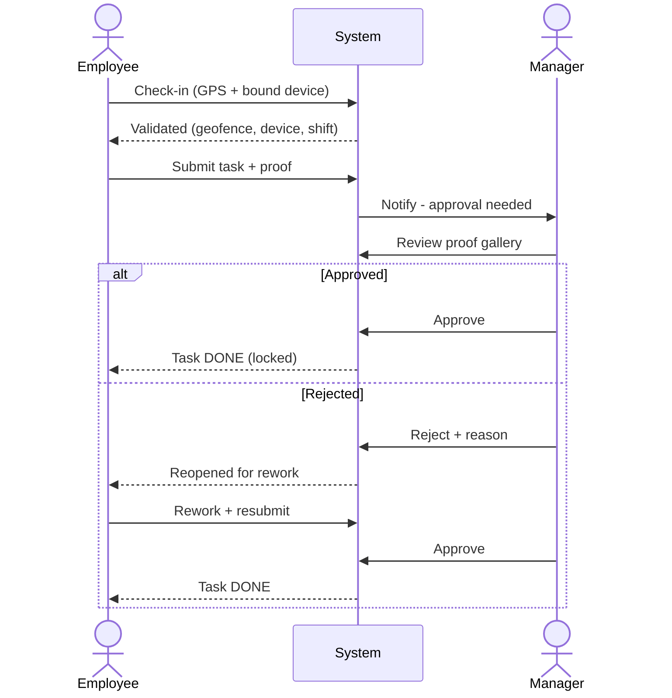

# Ara Tasks — User Flows & Workflows

**Purpose:** Map the real journeys people take through Ara Tasks — the centerpiece being the daily loop **from first login until a task is actually finished** (i.e. approved, not just submitted). Around that core loop, this document also traces the supporting flows that make the journey complete: onboarding, corrections, rework, escalation, offline sync, the owner's visibility journey, and the operator plane.

**Relationship to other docs:** Every step references the feature IDs from *Features Identification* / *Feature Catalog* (e.g. `ATT-04`, `TSK-07`) and respects the scopes in *User Roles & Permissions*. This is the behavioral layer on top of those definitions.

---

## How to read a flow

Each flow lists an **Actor**, its **Trigger** and **Preconditions**, then numbered steps. Within steps:

- **Check:** a system validation that can pass or block.
- **If … → …** a decision branch.
- **State:** the resulting status of the task/attendance record.
- **End state:** where the flow lands.
- Feature IDs in `code` show which capability powers each step.

**Flows covered:**

| # | Flow | Primary actor | Frequency |
|---|---|---|---|
| 0A | Company setup | Owner / Admin | Once |
| 0B | Employee join + device binding | Employee | Once |
| **1** | **Daily core loop (login → task done)** | **Employee + Manager** | **Daily** |
| 2 | Attendance correction | Employee → Manager | As needed |
| 3 | Task rejection & rework | Manager → Employee | As needed |
| 4 | Escalation (no response) | System → Managers | As needed |
| 5 | Offline capture & sync | Employee | As needed |
| 6 | Owner visibility journey | Owner | Daily/weekly |
| 7 | Operator plane (provision + break-glass) | Ara Tasks staff | As needed |

---
---

# FLOW 0A — Company Setup (one-time)

**Actor:** Owner / Admin · **Trigger:** signs up for Ara Tasks · **Precondition:** none.

1. Owner signs up → workspace (tenant) is created and the **trial** starts. `ORG-01`, `BIL-02`, `BIL-03`
2. Confirm localization: Arabic-first / RTL, AST timezone, Fri–Sat weekend, Hijri+Gregorian. `LOC-01–06`, `SET-04`
3. Create **branches** → set GPS coordinates, geofence radius, and working hours per branch. `ORG-02/03/04`
4. Create **departments** (including cross-branch) and optional **teams**. `ORG-05/06/07`
5. Define **shifts**: start/end, breaks, recurring patterns, grace threshold, overtime rules. `SHF-01–05`
6. Set up **roles**: keep defaults or build custom roles; decide each role's scope. `RBAC-02/03/05/06`
7. **Invite users** → assign each to branch/department/team, attach manager(s), mark the **Primary Manager**. `USR-02/04/05`, `ORG-10`
8. Tune **settings**: attendance policy (geofence radius, grace), task defaults, notifications, retention. `SET-01/02/03/05`, `LOC-08`

**End state:** company is operational; employees can now be onboarded and the daily loop can run.

---

# FLOW 0B — Employee Join + Device Binding (one-time)

**Actor:** Employee · **Trigger:** receives an invitation · **Precondition:** an Admin/Manager invited them.

1. Opens the invite (link / SMS). `USR-02`
2. Sets a password or verifies phone via **OTP-SMS**. `USR-06/07/08`
3. Grants **PDPL consent** for location capture (required before any GPS is stored). `LOC-07`
4. App registers the phone → **device binding** locks this user to this device. `USR-09`
5. First login lands on the **"My Day"** dashboard. `RPT-03`

**End state:** the employee is active, device-bound, and ready for the daily loop.

> **Edge case — no personal phone:** shared-device exception / kiosk mode is used instead of 1:1 binding. `USR-16`, `ATT-19` (Phase 2)

---
---

# FLOW 1 — The Daily Core Loop  *(login → task done)*

This is the heart of the product. It has two halves that meet in the middle: the **Employee** executes and submits; the **Manager** reviews and approves. A task is only *finished* when it reaches **Approved**.

## Task lifecycle (the state machine behind it) — `TSK-07`

## 1A — Employee: login → check-in → execute → submit

**Actor:** Employee · **Trigger:** start of shift · **Precondition:** active user, device-bound, has a shift today.

1. Open app → **Login** (phone/email + password, or OTP). `USR-06/07`
   - **Check:** account active? If suspended/deactivated → **blocked**. `USR-11`
   - **Check:** is this the bound device? If not → prompt a **re-bind request** (needs approval); cannot check in until resolved. `USR-09/10`, `ATT-04`
2. Land on **"My Day"** → today's shift, check-in button, and assigned tasks. `RPT-03`
3. Tap **Check-in**. `ATT-01`
   - System captures **GPS**. `ATT-02`
   - **Check:** inside the branch **geofence**? If no → check-in **blocked** ("you're not at the branch"). `ATT-03`
   - **Check:** **mock-location** detected? If yes → blocked / flagged. `ATT-14`
   - **Check:** from the **bound device**? If no → blocked. `ATT-04`
   - **Check:** on time vs shift + grace → records **on-time** or **late**; a late check-in fires a real-time alert to the manager. `ATT-05`, `SHF-04`, `NOT-05`
   - **State:** checked-in.
4. Open a **task** → see priority, deadline, checklist, and required proof. `TSK-04/05/06`
5. **Start** the task → **State: in progress**. `TSK-07`
6. Do the work → tick off **checklist** items. `TSK-06`
7. Attach **proof**: live-camera photo, note, checklist; GPS + timestamp stamped automatically. `PRF-01/02/03/04/05/09`
   - **Check:** location-bound task → must be at the branch to complete. `TSK-11`
   - **Check:** required proof present? If missing → **submit blocked**. `PRF-08`
8. **Submit** → **State: submitted (pending approval)**; the manager is notified. `TSK-07`, `NOT-04`
9. Repeat 4–8 for remaining tasks.
10. End of shift → **Check-out**. `ATT-01`
    - **Check:** leaving before shift end → **early-departure** flag. `ATT-07`
    - If forgotten → **missed-checkout** handling auto-closes/flags the session. `ATT-10`

**End state (employee side):** shift closed; tasks sit in **submitted**, waiting on the manager.

## 1B — Manager: review → approve / reject

**Actor:** Manager / Supervisor · **Trigger:** a task is submitted (or a push alert arrives). `NOT-04`

1. Login → **Manager dashboard**, scoped to their branch/department/team. `RPT-02`
2. Open the **approval inbox** — a queue of everything pending. `APR-07`
3. Open a submitted task → review the **proof gallery** (photos, notes, GPS pin, timestamp). `PRF-06`
4. **Decision:**
   - **Approve** → **State: approved**; the item **locks**. In a multi-manager setup, the **first valid decision wins**. `APR-01`, `APR-04`
   - **Reject with reason** → **State: reopened**; the employee is notified to redo it. `APR-02`
5. If no decision within the escalation timer → the item escalates (see **Flow 4**). `APR-05`, `APR-08`

**End state:** the task is **Approved (done)** or **Reopened (back to the employee)**.

## End-to-end: how a task actually finishes

**Definition of done:** proof attached → submitted → a permitted manager approves → item locked and written to the audit trail with the decider's name. `PRF-08`, `APR-01/04`, `AUD-03`

---
---

# FLOW 2 — Attendance Correction

**Actor:** Employee → Manager · **Trigger:** a wrong/missing attendance record.

1. Employee opens their **attendance timeline**, finds the bad record. `ATT-11`
2. Submits a **correction request** with a reason. `ATT-08`
3. Manager is alerted → opens the request. `NOT-04`
4. **Decision:** approve → record fixed; or reject → record stands. First valid decision wins, logged with the decider's name. `ATT-09`, `APR-03/04`, `AUD-03`

**End state:** attendance record corrected or left as-is, with an audit entry either way.

---

# FLOW 3 — Task Rejection & Rework

**Actor:** Manager → Employee · **Trigger:** submitted work isn't good enough.

1. Manager rejects with a **reason** → **State: reopened**. `APR-02`, `TSK-07`
2. Employee gets the alert, reads the reason, redoes the work. `NOT-03`
3. Attaches **new proof** → resubmits. `PRF-01–08`
4. Loop until **approved**, or the manager **reassigns** it to someone else. `TSK-08`

**End state:** task approved after rework, or reassigned.

---

# FLOW 4 — Escalation (no response)

**Actor:** System → Managers · **Trigger:** a pending decision (or overdue task) sits untouched past the timer.

1. Task/decision passes its escalation timer. `APR-08`, `TSK-12`
2. Escalation climbs the **Primary Manager** line first. `APR-05`, `ORG-10`
3. Still no response → **fan-out** to other in-scope managers. `APR-06`
4. Alerts travel up the chain. `NOT-06`
5. The **first valid decision** anywhere in scope locks the item. `APR-04`

**End state:** the item is decided by whoever responds first — no single absent manager can freeze the operation. This is the "same-day intervention" guarantee.

---

# FLOW 5 — Offline Capture & Sync

**Actor:** Employee · **Trigger:** weak or no connectivity at the site.

1. Check-in / proof is captured **locally** with GPS + timestamp and queued. `ATT-13`, `APP-04`
2. The app keeps working; nothing is lost.
3. On reconnect, the queue **syncs** to the server.
4. Server validates geofence/device **retroactively**; any conflict is flagged for a manager. `ATT-03/04`

**End state:** attendance/proof lands correctly once online, with conflicts surfaced rather than silently accepted.

---

# FLOW 6 — Owner Visibility Journey

**Actor:** Owner · **Trigger:** wants the picture without chasing anyone.

1. Login → **Owner dashboard**, company-wide. `RPT-01`
2. Read live KPIs: **who's in now**, on-time %, proof-coverage %, lateness. `ATT-12`, `RPT-06/07/11`
3. **Compare branches** on real data. `RPT-08`
4. **Drill down**: company → branch → employee to find the source of a bad number. `RPT-09`
5. *(Phase 2)* Ask the **AI assistant** ("who's late today?") or receive **early-warning** signals before a branch slips. `AI-01/06`
6. **Export** for payroll / stakeholders. `RPT-10`

**End state:** an informed decision or intervention, based on facts instead of gut feeling.

---

# FLOW 7 — Operator Plane (Ara Tasks staff)

Two representative operator journeys. These never touch tenant contents by default.

## 7A — Provision a new customer
1. Ops logs into the **operator console** (separate identity, mandatory 2FA/SSO). `PLT-01/02`
2. **Provision** the tenant and pin its **data-residency region**. `PLT-04/07`
3. Assign a **plan** and its feature entitlements. `PLT-10/11`

**End state:** the customer's workspace exists, isolated, on a plan — ready for Flow 0A.

## 7B — Break-glass support access
1. Ops needs to see what the customer sees → requests **impersonation**. `PLT-08`
2. Access is **consented (or contractually authorized), time-boxed, read-only by default**.
3. A **banner** shows inside the tenant while active; the session is written to **both** audit trails. `PLT-09`, `AUD-07`
4. Session auto-expires.

**End state:** the issue is diagnosed with a full, dual-sided trail — no silent backdoor.

---
---

# The Golden Path (one line)

> **Login → Check-in (geofence + device) → open task → do it → attach proof → submit → manager approves → DONE.**

Everything else in this document is what happens when that path bends: a wrong check-in (Flow 2), rejected work (Flow 3), an unresponsive manager (Flow 4), or a dead signal (Flow 5).

*Next in the chain: wireframes/screen flows per role, then a prioritized backlog (epics → user stories) mapped to these flows.*
